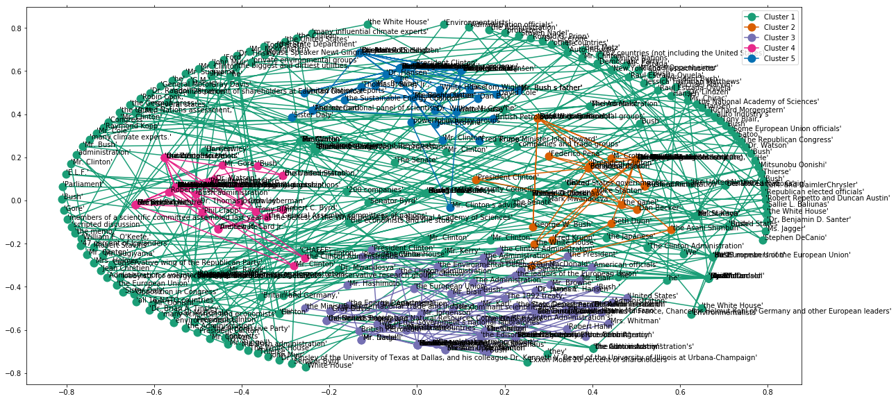

## Table of contents
* [Intro & installation](#introduction)
* [The Data](./Data)
* [The Annotator](#the-annotator)
* [Claim classification](#claim-classification)
* [The Tagger](#the-tagger)
  * [CRF tagger](#crf-tagger)
  * [BiLSTM tagger](#bilstm-tagger)
  * [BiLSTM-CRF tagger](#bilstm-crf-tagger)
* [Political Discourse network](#political-discourse-network)

## Introduction

### Objective: 
* To tag and model ACTOR(any Person/Organisation) and their corresponding CLAIM(S) made on environmental issues, emmisions and/or climate-change and whether they support the claim or not. We also wish to generate and visualize a poltical discourse network hence generated from the annotations and analysis. 


#### For Linux/Ubuntu based systems:

```
#### 1. Install python virtualenv:
$ pip install virtualenv 

#### 2a. Create a virtual environment
$ virtualenv climachange_env
## OR
$ python3 -m virtualenv climachange_env 

#### 2b. Add virtual environment to jupyter-notebook (for using the .ipynb notebooks)
$ python3 -m ipykernel install --user --name=climachange_env  

#### 3. Activate virtual environment
$ source climachange_env/bin/activate

#### 4. Create git clone repo
$ git clone https://github.com/parashar-lonewolf/ClimaChange_Claims.git

#### 5. Move to folder
$ cd ClimaChange_Claims

#### 6. Install requirements
$ pip install -r requirements.txt 

#### 7. Run Annotator
$ python3  ACTOR_CLAIM_ANNOTATOR.py 
```
## The annotator
#### Instructions for using the Annotator :
* All tagged data will be stored in ConLL format as: ConLLformat_annotator.txt (here you see ConLLformat_annotator_ank/ian.txt) as shown [here](#conLL-annotated-data-format-and-example)
* All claims and tagged data will be stored in [Save](./Save) folder (here you see Claims_ank/ian.txt)

#### The GUI windows 
##### To explain how this works, As an example lets talk about a claim made by Bill Clinton from the NYT article from 1997/06/23 (this is stored  in Claims.txt which is the [Save](./Save) folder)

" *But in a sharp dispute with France and other European nations that dominated this morning's final session of ''The Summit of the Eight,'' President Clinton refused to commit the United States to a specific reduction in the emission of carbon dioxide and the other greenhouse gases that contribute to global warming, agreeing only to ''substantial reductions'' by 2010.* "
                                                    
### 1. 
  * "'So do you think this has a CLAIM ?'

You answer yes by selecting a new actor, here *President* and *Clinton* and clicking **Next** (if the annnotator has already correctly chosen the actor for you, you may just click **Next**)


### 2.
  * 'Select the Claim boundaries'

This brings us to the claim annotations, where we have to select the words to be used as boundaries, i.e
the first word and the last word of the claim sequence. You can select *commit* and *warming,* on the window. Choose if the actor **Supports** or is **Against** the claim (in this case since he ' "refused" to commit ', it's **Against**) and click on **Next**


3. if you select **Cancel** at WINDOW 1, you remove that sentence from tagging criterias.
4. if you select **Exit** the prgram ends and, when restarted, it restarts at the candidate sentence quit, so progress is autosaved by default.
5. If you select **Save Prev Annotations**, it will save all current progress of dataset annotations in the [Save](./Save) folder as Progress_Manager.txt(saved here as Progress_Manager_ank/ian.txt),
and once you exit and restart, the annotation will continue from the last annotation point.
6. In case, you made a mistake in the annotation, the current version addresses the issue as:
    * click on **Save Prev Annotations**
    * press **Exit**
    * rerun the annotator program

#### ConLL annotated data format and example
   * ConLL format used: (Using above output as example)
   * Token no in sent | Fine-grained tag | Token entity type | token Relation | Actor-Claim-O tag | (optional)(+/-) supports/opposes


## Claim classification
All the tagged Claims are classified into 5 clusters using K-means:
* [k-means clusering of claims](./KMeans_Claim_Custering.ipynb)
* The output is portrayed below (also check https://claimclusters.tiiny.site/)



## The Tagger

### CRF Tagger

* [Notebook with CRF tagger train/test with and without claim classification](./CRF_ActorClaim_tagger.ipynb)      

This notebook has a functional models made using CRF as a proof of concept, since we havent annoatted enough data, the model files are also available for use in [Pickles](./Pickles) folder. We have trained 3 models each of clustered and unclustered data and run them for 500,1000 and 1500 iterations respectively

### BiLSTM Tagger

The Taggers below use BERT embeddings, from here: https://github.com/google-research/bert
1. BERT Tiny:  L=2, H=128, A=2 
2. BERT base uncased: L=12, H=768, A=12 

* [Notebook with BiLSTM with BERT_uncased_L-12_H-768_A-12](./BiLSTM_model_tagger_2.ipynb)
* [Notebook with BiLSTM with BERT_tiny_2_128](./BiLSTM_model_tagger.ipynb)

This notebook has a functional models made using BiLSTM as a proof of concept, since we havent annoatted enough data.

### BiLSTM-CRF Tagger

1. BERT Tiny:  L=2, H=128, A=2 

* [Notebook with BiLSTM+CRF with BERT tiny_2_128](./BiLSTM_CRF_model_tagger.ipynb)

This notebook also has functional models made using BiLSTM + CRF models as a proof of concept, and that they yield much better results than only BiLSTM models, given we havent annotated enough data.

## Political discourse network

* This notebook uses 'jgraph' to create political discourse:
[ Political discourse network over time](./Political_Discourse_networks.ipynb)

#### As an example we show you two of our Political discourse graphs generated from our annotations, from 1997 and 2002
* 
* 
